<p>
    <h1 align="center">
            오늘 할 일 내일로
    </h1>
</p>

<p align="center">
    <a href="https://travis-ci.org/steverichey/google-play-badge-svg">
        
    </a>
    <a href="./license.md">
        
    </a>
</p>

<p align="center">
  • <a href="#about">About</a>
  • <a href="#usage">Usage</a>
  • <a href="#screen-shot">Screen shot</a>
  • <a href="#Team">Team</a>
  • <a href="#license">License</a>
</p>


## About

"오늘할일 내일로" 는 내일로 여행 계획을 세우기 위한 앱입니다!

- 여행지 추천
  - 사용자 관심사 기반으로 관광지를 추천 해드립니다.

- 다양한 정보
  - 관광지, 기차, 식당, 숙박, 레포츠, 문화시설, 축제/행사, 날씨 등 다양한 정보가 준비되어 있습니다.

- 마이플랜
  - 관심있는 여행지를 추가해서 계획을 세울 수 있습니다.

- 경로추천
  - 마이플랜에 담긴 여행지의 경로를 추천해 드립니다!

내일로 뿐만 아니라 기차여행 시 유용하게 사용하실 수 있습니다. 많은 이용 바랍니다 ~!

## Usage

- 플레이스토에서 다운가능합니다!
<p align="center">
<a href="https://play.google.com/store/apps/details?id=com.koreatech.naeilro">

</img>
</a>
</p>


## Screen shot
<p align="center">
        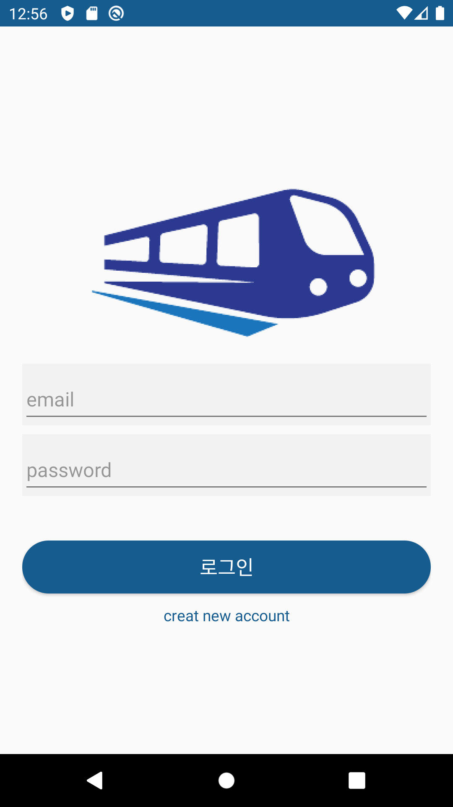&nbsp;&nbsp;&nbsp;
        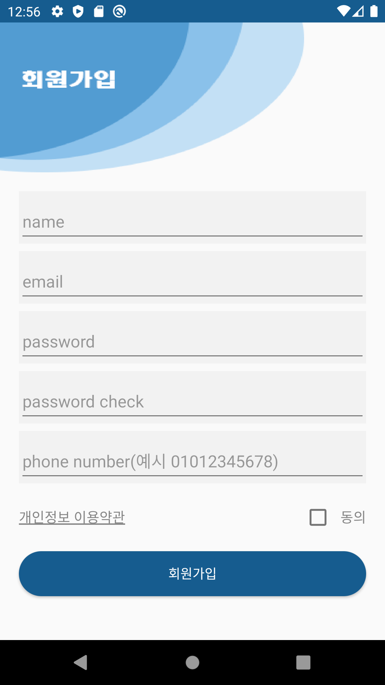&nbsp;&nbsp;&nbsp;
        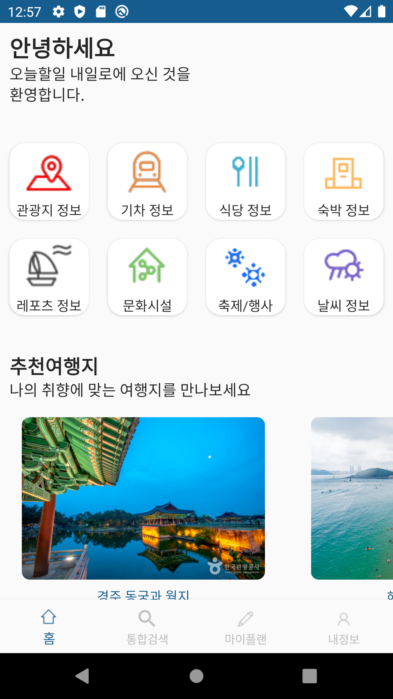&nbsp;&nbsp;&nbsp;
        &nbsp;&nbsp;&nbsp;<br>
        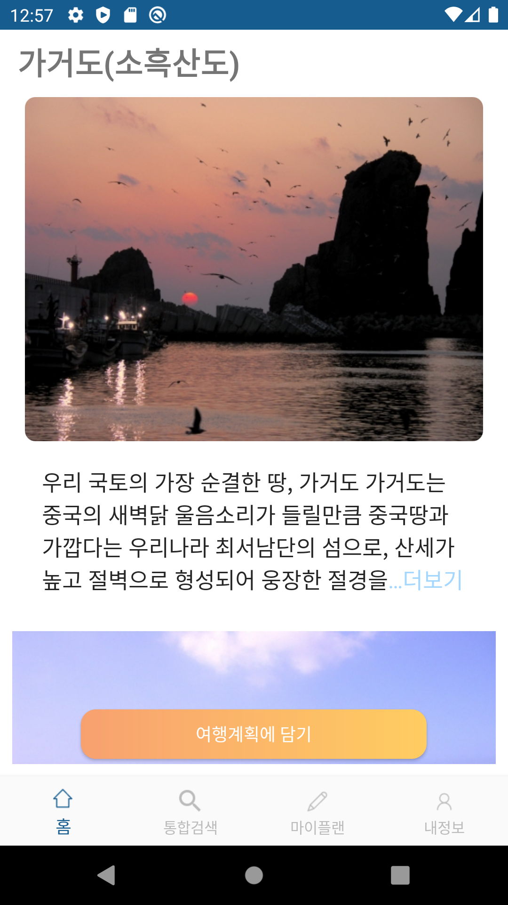&nbsp;&nbsp;&nbsp;
        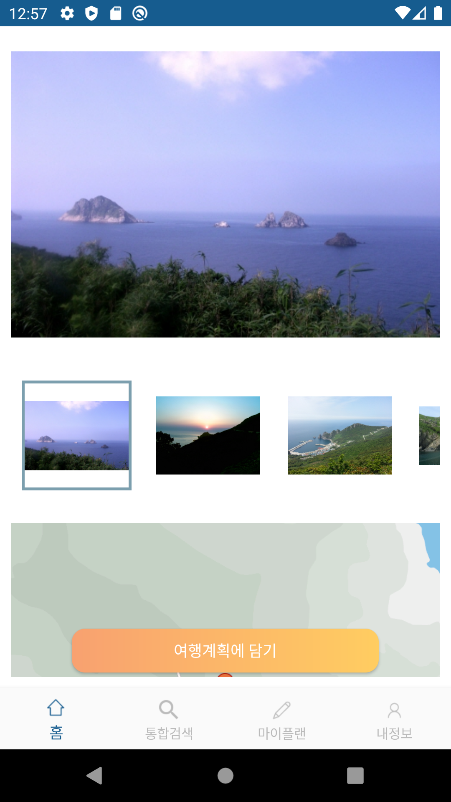&nbsp;&nbsp;&nbsp;
        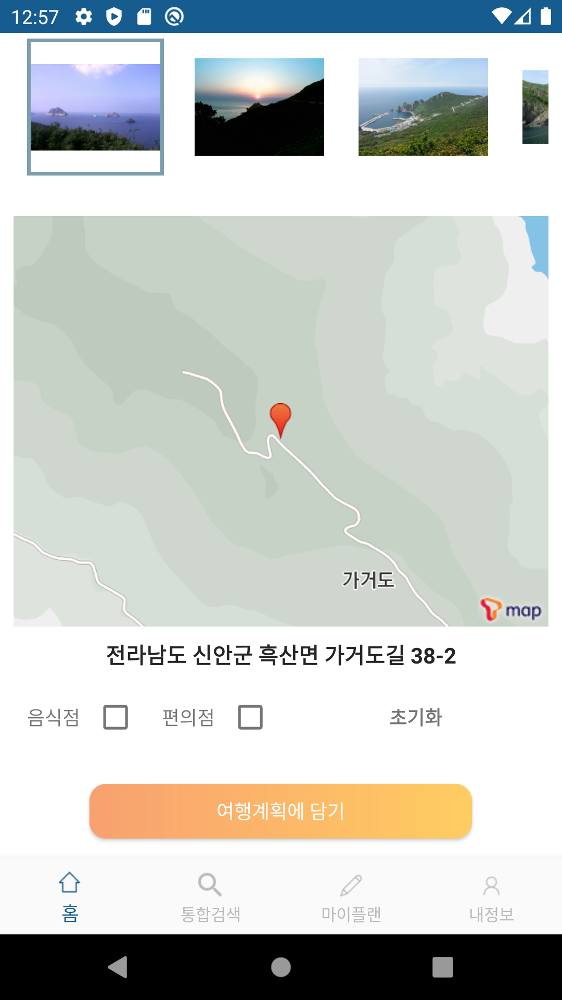&nbsp;&nbsp;&nbsp;
        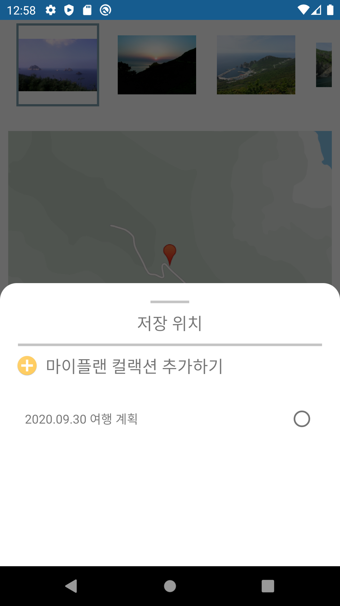&nbsp;&nbsp;&nbsp;<br>
        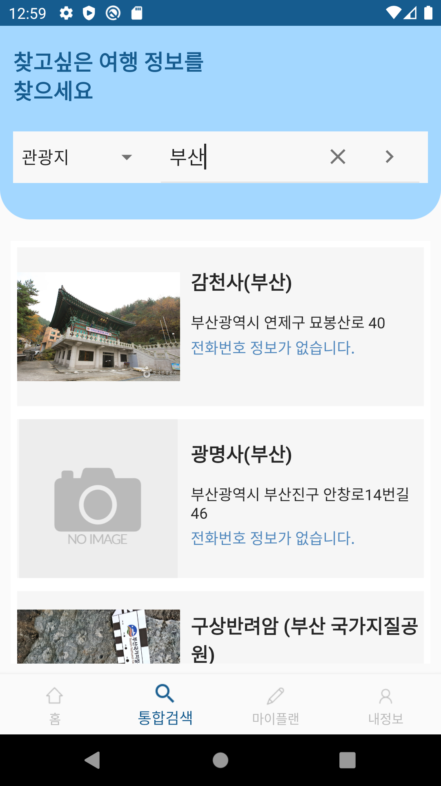&nbsp;&nbsp;&nbsp;
        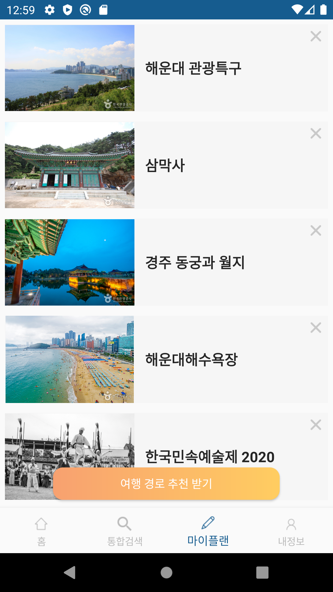&nbsp;&nbsp;&nbsp;
        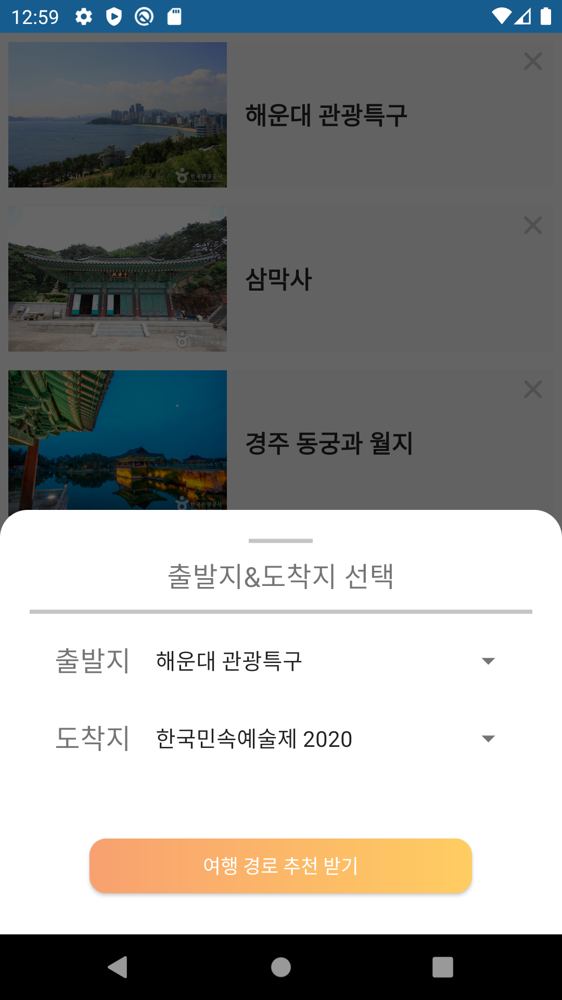&nbsp;&nbsp;&nbsp;
        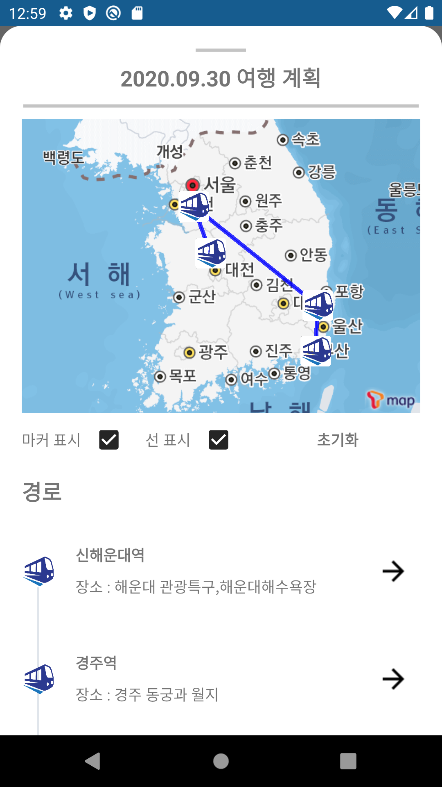&nbsp;&nbsp;&nbsp;<br>
</p>


## Team

- 2014136087 이경형 (Back-End)
- 2015136046 나윤재 (PM, Android)
- 2015174060 이기주 (Back-End)
- 2015136126 주동민 (Android)

## License

```
Copyright 2020 yunjaena (NGN Lab)

Licensed under the Apache License, Version 2.0 (the "License");
you may not use this file except in compliance with the License.
You may obtain a copy of the License at

    http://www.apache.org/licenses/LICENSE-2.0

Unless required by applicable law or agreed to in writing, software
distributed under the License is distributed on an "AS IS" BASIS,
WITHOUT WARRANTIES OR CONDITIONS OF ANY KIND, either express or implied.
See the License for the specific language governing permissions and
limitations under the License.
```
